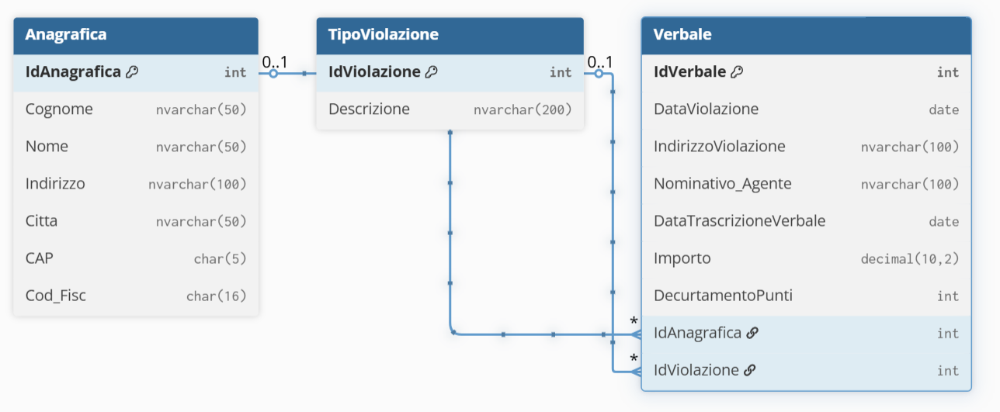

# Database Polizia Municipale – Gestione Verbali

Questo progetto rappresenta la struttura di un database SQL Server per la gestione
dei **verbali**, dei **clienti (anagrafica)** e dei **tipi di violazione** contestati
dal Corpo di Polizia Municipale.

L'obiettivo è fornire un modello chiaro, estensibile e normalizzato, utile per
applicazioni gestionali, sistemi informativi e piattaforme web.

---

## ERD – Entity Relationship Diagram

Di seguito lo schema completo del database, con tutte le relazioni tra le tabelle:

---

## Struttura del database

### **1️ Anagrafica**
Contiene i dati personali dei cittadini a cui sono associati i verbali.

| Campo | Tipo | Descrizione |
|------|------|-------------|
| IdAnagrafica | INT (PK) | Identificativo univoco |
| Cognome | NVARCHAR(50) | Cognome del cittadino |
| Nome | NVARCHAR(50) | Nome del cittadino |
| Indirizzo | NVARCHAR(100) | Indirizzo di residenza |
| Città | NVARCHAR(50) | Città |
| CAP | CHAR(5) | Codice postale |
| Cod_Fisc | CHAR(16) | Codice fiscale |

---

### **2️⃣ TipoViolazione**
Catalogo dei tipi di infrazione.

| Campo | Tipo | Descrizione |
|------|------|-------------|
| IdViolazione | INT (PK) | Identificativo tipo violazione |
| Descrizione | NVARCHAR(200) | Descrizione completa dell’infrazione |

---

### **3️⃣ Verbale**
Registra ogni singolo verbale associato ad una persona e ad un tipo violazione.

| Campo | Tipo | Descrizione |
|------|------|-------------|
| IdVerbale | INT (PK) | Identificativo verbale |
| DataViolazione | DATE | Data dell'infrazione |
| IndirizzoViolazione | NVARCHAR(100) | Luogo dell’infrazione |
| Nominativo_Agente | NVARCHAR(100) | Agente che ha contestato |
| DataTrascrizioneVerbale | DATE | Data trascrizione |
| Importo | DECIMAL(10,2) | Importo della multa |
| DecurtamentoPunti | INT | Punti decurtati |
| IdAnagrafica | INT (FK) | Riferimento cittadino |
| IdViolazione | INT (FK) | Tipo violazione |

---

## Tecnologie utilizzate

- **SSMS**
- **SSE**
- **DBML / dbdiagram.io**

---

## Autore

Realizzato da **Riccardo Reali**  ©2025
